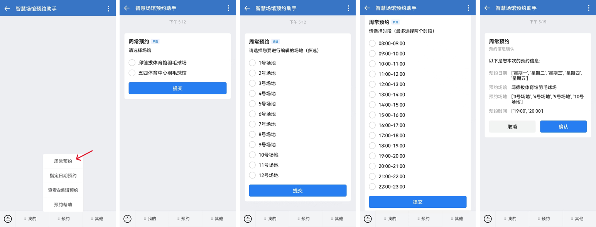
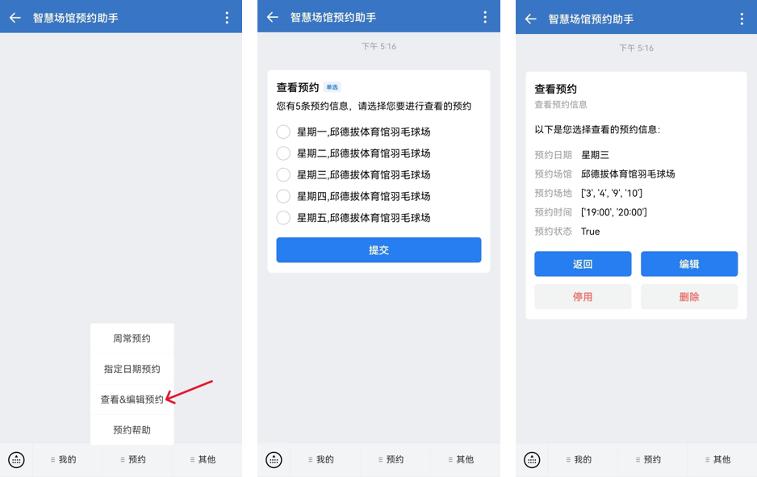
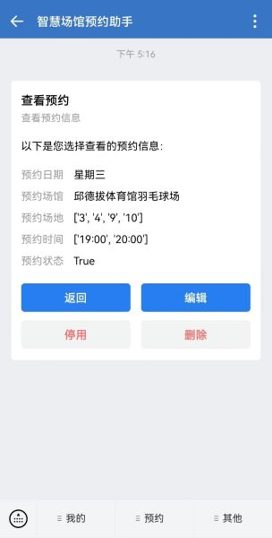

# 智慧场馆自动预约工具


## 项目声明

1）本工具采用 Python3 完成自动化操作，实现全自动预约场馆；  
2）支持基于企业微信企业号应用的互动操作，体验更佳；  
3）本项目为非官方项目；  
4）本项目提交的修复和需求皆为开源，任何维护该项目的小伙伴皆可参考，但尽量注明出处；  
5）使用本项目请尽量保持低调，尽可能不在微信群、树洞、BBS传播，自己使用即可；  
6）欢迎任何形式的pr，请尽量将pr内容描述清楚；  


## 开发路线及支持功能

[开发路线]()

- [x] 支持多线程自动预约场馆
- [x] 支持自动填写验证码
- [x] 支持自动支付
- [x] 支持用户注册，修改与注销
- [x] 支持微信交互
- [x] 更多功能请查阅 [版本发布]()  更新日志 

## 安装

### Python 3

本项目需要 Python 3，可以从[Python 官网](https://www.python.org/)下载安装，仅支持python3.10以上版本，如发现缺少依赖包需额外安装。

## 运行项目

### 1、配置基础参数
1. 用文本编辑器（建议代码编辑器）打开项目根目录下 `config.yaml` 文件配置 `setting` 、 `time`、`wechat`、`operate` 这几个 Section 下的变量，在 `config.yaml` 文件内有详细注释

### 2、本地运行（无微信交互）
1. 将 `config.yaml` 中 `operate` Section下的变量设置为：`wechat_notice: False`、 `rsa_encrypt: False`、`local_sql: True`。

2. 运行run.py
   ```
   nohup python3 run.py & 
   ```

### 3、微信交互运行
1. 将 `config.yaml` 中 `operate` Section下的变量设置为：`wechat_notice: True`、`rsa_encrypt: True` 、`local_sql: False`。

2. 参考 [NASTOOL消息通知之微信通知设置全解析](https://post.smzdm.com/p/avxz4809/)
   *  Frpc客户端可以根据自己的需求选择不同平台应用；   
   *  获得企业ID，应用ID，应用secret，Token，EncodingAESKey，消息推送代理后，填入config.yaml对应的地方。

3. 运行run.py
   ```
   nohup python3 run.py & 
   ```

## 使用教程
### 1、本地运行（无微信交互）
打开项目文件夹 `scripts/sqls` 下的文件 `init_users.sql` ,参考内容添加所需预约信息。
### 2、微信交互运行
由于企业微信和微信支持接口不同，交互运行分为两种，命令交互和模板卡片交互：命令交互是指使用对话框直接发送命令的方式进行预约操作等，模板卡片交互是通过点击底部菜单和对话框中可交互的卡片进行交互；部分功能支持模板卡片交互；微信仅支持命令交互，而企业微信二者都支持。
1. 添加个人信息：
   *  命令：
      ```
      /Add_Personal_Info --Account=<account> --Password=<password> --Phone=<phone> [--Pay={0|1|2|3}]
      ```
      其中参数account为IAAA登录账号；password为IAAA登录密码；phone为电话号码；参数Pay为可选，值为0~3，默认为0，0代表不自动支付，预约成功后需自行至智慧场馆中登录；1为校园卡自动支付，预约成功后会使用校园卡自动支付；2为微信支付，预约成功后会发送微信付款二维码；3为支付宝支付，预约成功后会发送支付宝付款二维码。</br>
      例如需要预约的账号为“12345678”，密码为“12345abcde”，手机号为：“18866669999”，选择支付方式为“校园卡自动支付”，则应输入命令：
      ```
      /Add_Personal_Info --Account=12345678 --Password=12345abcde --Phone=18866669999 --Pay=1
      ```
2. 查询&编辑个人信息：   
   *  命令：
      ```
      /Edit_Personal_Info [--Account=<account>] [--Password=<password>] [--Phone=<phone>] [--Pay={0|1|2|3}]
      ```
      根据需要选择参数进行修改，没有参数则为查询个人信息
3. 注销个人信息
   *  命令：
      ```
      /Delete_Personal_Info
      ```
4. 添加预约：</br>
   *  命令：
      ```
      /Add_Appoint {--Week=[1~7]|Date=<date>} --Gym={0|1} --Field={[1~12]|[1~9]} --Time={[06:50~22:00]|[8:00~22:00]} [--Status={0|1}]
      ```
      其中参数Week为周几（列表），Date为具体日期（年-月-日）；Gym为场馆，0为邱德拔体育馆羽毛球场，1为五四体育中心羽毛球馆；Field为场地编号列表，根据场馆不同范围不同，邱德拔为1-12，五四为1-9，预约时按列表顺位进行场地预约；Time为需要预约场地的开始时间列表，根据场馆不同范围不同，具体可登录智慧场馆自行查看，每人每天最多两个时段；Status为可选项，为0或1，默认为1，1代表启用该预约信息，0代表不启用。</br>
      例如需要预约周三和周四的场地，场馆为邱德拔体育馆羽毛球场，场地顺序为3、4、9、10，时间为20：00-21：00、21：00-22：00，预约状态为启用，则应输入命令：
      ```
      /Add_Appoint --Week=[3,4] --Gym=0 --Field=[3,4,6,9] --Time=[21:00,22:00] --Status=1
      ```
   *  卡片交互：</br>
   
5. 查询预约：</br>
   *  命令：
      ```
      /View_Appoint
      ```
      查询所有预约信息，每条预约信息签会附带对应预约信息ID。
   *  卡片交互：</br>
   
6. 编辑预约：</br>
   *  命令：
      ```
      /Edit_Appoint [--ID=<id>] [--Gym={0|1}] [--Field={[1~12]|[1~9]}] [--Time={[06:50~22:00]|[8:00~22:00]}] [--Status={0|1}]
      ```
      其中参数ID为需要编辑的预约信息ID；Gym为场馆，0为邱德拔体育馆羽毛球场，1为五四体育中心羽毛球馆；Field为场地编号列表，根据场馆不同范围不同，邱德拔为1-12，五四为1-9，预约时按列表顺位进行场地预约；Time为需要预约场地的开始时间列表，根据场馆不同范围不同，具体可登录智慧场馆自行查看，每人每天最多两个时段；Status为可选项，为0或1，1代表启用该预约信息，0代表不启用。</br>
   *  卡片交互：</br>
   
## 使用须知
### 1、隐私政策
由于IAAA登录需求以及技术限制，本应用需要获取您的IAAA账号和密码，在您提交这些信息后，这些信息会被RSA加密后储存在后台数据库中，其中RSA密钥由应用管理员指定，故理论上有且仅有管理员可以获取您的账号密码。因此，您应当自行部署该应用或选择一名值得信任的应用管理员。
但是由于任何接触到服务端的人都可能通过调试程序、读取内存、网络抓包等方式获取到应用后台所有数据，或是由于其他未列出的因素导致您的隐私信息泄露，故开发者无法对您的隐私信息安全作出任何保障，亦不对您隐私信息的泄露负责。您应当慎重提交您的IAAA账号和密码，特别是当您不熟悉该应用的部署者和管理员时。如您怀疑您的IAAA账号密码已遭泄露，您应当点击底部菜单栏“我的-注销个人信息”在系统中注销您的个人信息，您的所有个人信息和预约信息会在数据库中被彻底删除，并且您应该立即修改您的账号密码。
同时，由于自动预约操作可能导致账号被智慧场馆系统列入风控名单甚至封禁，开发者亦不负责。
### 2、免责声明
1）本软件仅供学习交流使用，对用户的行为及内容毫不知情，使用本软件产生的任何责任需由使用者本人承担。  
2）本软件代码开源，基于开源代码进行修改，人为去除相关限制导致软件被分发、传播并造成责任事件的，需由代码修改发布者承担全部责任，不建议对用户认证机制进行规避或修改并公开发布。  
3）本项目没有在任何地方发布捐赠信息页面，也不会接受捐赠或收费，请仔细辨别避免误导。


## 常见问题
### 1. 其他人无法使用应用
> 问题描述
> 在企业微信中新邀请的人无法使用应用

解决办法：
*  确认用户成功下载并注册了企业微信，进入到了企业中；
*  在企业微信中设置部门权限，包括应用可见范围和用户部门。


